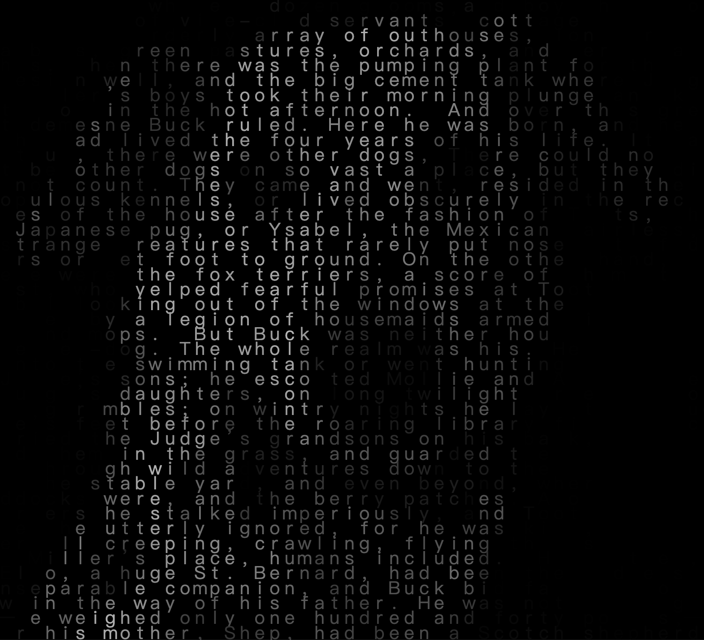

# zhyu0510_9103_tut3

# Quiz 8

## Part 1: Imaging Technique Inspiration
I learned the "Particle Deconstruction-Recombination" technique of Amuki Tools No.173: Particles. It turns the graphic text into lattice particles, which are dispersed, rotated, and reaggregated after being forced. I plan to turn Picasso's "Dove of Peace" into numbered particles, like a "Tamagotchi" on the screen, but when the mouse approaches, the repulsion, flow, and rotation of the particles mean that the pigeon is released, symbolizing respect for the freedom of animals.

[View project on Behance](https://www.behance.net/gallery/189942767/Amuki-Tools-No-173-Particles/modules/1074181599)

## Part 2: Coding Technique Exploration
I will use Daniel Shiffman’s Image to ASCII code as the base for my interactive “number-particle dove.” The program converts an image into text characters according to pixel brightness, creating a dynamic grid that rebuilds the image every frame. By replacing letters with numbers, each digit becomes a moving particle that forms the dove’s outline. Next, I will add mouse-driven forces so the numeric particles scatter, flow, and rotate when hovered—visually expressing the idea of freedom and release from Part 1.

[Example Code – Perlin Noise Flow Field (p5.js)](https://editor.p5js.org/codingtrain/sketches/LNBpdYQHP)

## References
